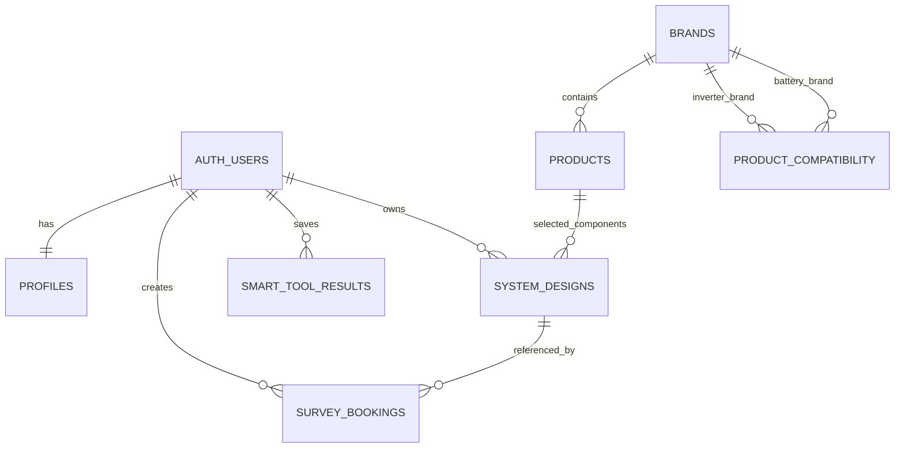

# Database Schema

## Overview

The initial KaamAsaan schema separates public marketplace catalog data from private customer planning and booking records.

## Tables

### `profiles`

Extends Supabase Auth users.

| Column | Purpose |
| --- | --- |
| `id` | Primary key linked to `auth.users.id` |
| `full_name`, `phone`, `city` | Customer or staff profile information |
| `role` | `customer`, `admin`, or `installer` |
| `created_at`, `updated_at` | Creation and last-update timestamps |

### `brands`

Stores public product brands grouped by marketplace category.

Categories: `solar_panel`, `inverter`, `battery`, `mounting_structure`, `accessory`.

Stable `slug` values support admin forms, URLs, analytics, and API filtering.

### `products`

Stores marketplace products and their technical specifications.

Important fields include `slug`, optional `sku`, capacities, currency, price, stock state, warranty, image URL, featured state, active state, and flexible `specifications` JSONB.

### `product_compatibility`

Stores approved inverter-brand to battery-brand compatibility rules.

Example: Fox inverter brand to Fox battery brand. Initial compatibility is brand-level. Model-level overrides can be introduced later if verified product rules require them.

### `system_designs`

Stores a customer's draft or completed solar configuration and calculator outcome.

Selected products are linked to `products`. Additional journey state belongs in `design_data`.

### `survey_bookings`

Stores solar surveys and service booking requests.

Booking types: `solar_survey`, `preventive_maintenance`, `installation`, `net_metering`.

A booking may reference the customer's saved `system_design_id`. `preferred_time_slot` is stored separately from the requested date. Each booking has a generated `reference_code` such as `KA-98B59FCE` for customer-facing journey tracking.

Journey statuses: `pending`, `confirmed`, `survey_scheduled`, `survey_completed`, `proposal_preparation`, `quotation_shared`, `installation_planning`, `installation_completed`, `cancelled`. The previous `completed` value remains readable as a legacy alias for existing rows.

### `smart_tool_results`

Stores input/output history for load, roof, ROI, battery backup, and solar size tools.

## Relationship Summary

## Design Notes

- Product category exists on both `brands` and `products` to make filtering fast and explicit.
- Database triggers reject products, compatibility rules, or saved designs with invalid category relationships.
- Product capacity fields are nullable because each category uses different measurements.
- `design_data`, `input_data`, `result_data`, and `specifications` are JSONB for evolving calculator and technical metadata.
- Mutable records use `updated_at` triggers.
- Installer assignment is deferred until the operational booking workflow is defined.

## Indexed Access Paths

- Public brand browsing by active category.
- Public product browsing by category and brand.
- Product name/model search through `pg_trgm`.
- Product specification filtering through a JSONB GIN index.
- Compatibility lookup from inverter brand and battery brand.
- Customer design, booking, and smart tool history ordered by creation time.
- Admin booking queues ordered by status and creation time.

## Planned Follow-Up Tables

Do not add these until the workflow is confirmed, but reserve them as separate migrations:

- `orders`, `order_items`, `order_status_history`
- `payment_transactions`, `payment_webhook_events`
- `installer_profiles`, `booking_assignments`, `service_tracking_events`
- `notifications`, `notification_preferences`
- `audit_logs`
